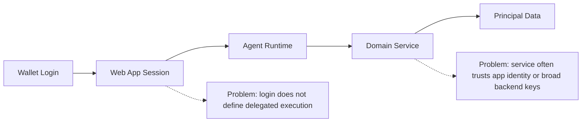
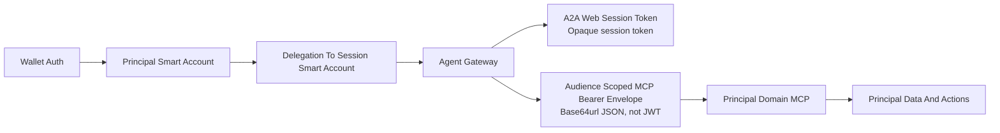
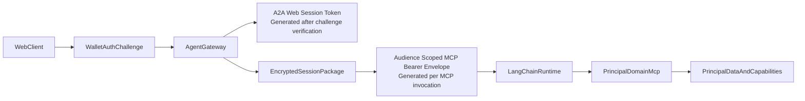
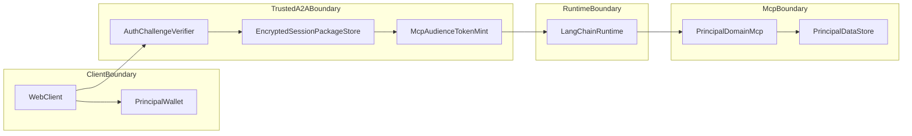
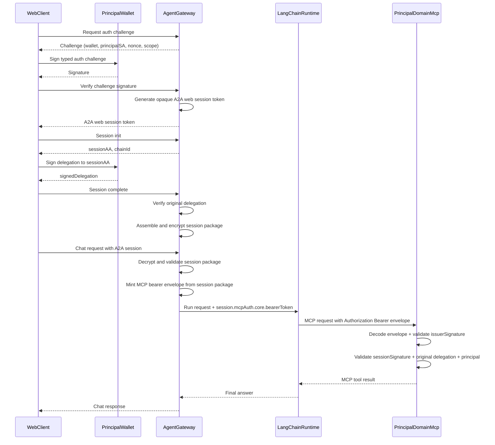
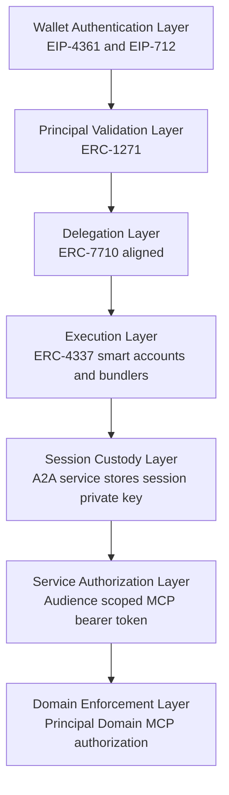

# SIWE For Agents: Principal Delegation And MCP Protocol Architecture

## Status

Draft protocol architecture document.

## Why This Exists

Wallet sign-in is good at answering one question: who controls this wallet right now.

It does not answer the harder question this protocol is built for:

- how an agent can safely act for a person or organization
- across multiple domains such as Faith, Fitness, and Finance
- without exposing long-lived delegated keys to the browser
- without ever passing the session wallet private key out of the trusted A2A agent service
- without relying on broad backend API keys
- without trusting caller-supplied principal identifiers on downstream services

This protocol exists to extend Ethereum-style authentication into verifiable delegated agent execution. It is protocol-centric, grounded in Ethereum standards and standards-track account-abstraction patterns, and designed so downstream services can independently validate the full chain before touching principal data.

Without this pattern, most systems collapse into one of two weak models:

- the browser or app gets too much long-lived authority
- the backend acts with broad service credentials and only loosely maps requests back to the user

The protocol replaces that with a delegation chain:

## Purpose

This document describes the end-to-end authentication, delegation, and authorization flow for an agent system that mediates access to principal-scoped domain services:

1. Web client
2. Per-user Agent Gateway
3. LangChain/LangGraph runtime
4. Principal Domain MCP

The goal is to provide a standards-style description of how wallet authentication, principal smart-account delegation, session packages, and MCP authorization work together to safely access principal-scoped data.

## Scope

This document covers:

- Web login and challenge signing
- A2A session establishment
- Delegation bootstrap
- Session package creation and storage
- Runtime MCP token minting
- LangChain MCP transport injection
- delegated Principal Domain MCP authorization

This document does not define:

- On-chain agent registration
- Multi-MCP federation beyond the Principal Domain MCP pattern
- Cross-domain revocation registries
- Non-wallet authentication methods

## Architecture Highlights

- the principal smart account is the authority root for delegated agent execution
- the session wallet private key is generated and securely stored only inside the trusted Agent Gateway
- the original principal-to-session delegation is verified by the Agent Gateway before storage
- the Agent Gateway mints only short-lived, audience-scoped MCP authorization artifacts
- the implementation currently uses an opaque A2A web session token plus a base64url-encoded MCP bearer envelope, not a standards-format JWT
- the LangChain runtime carries auth metadata but never receives the underlying session private key
- the downstream Principal Domain MCP validates the token, session proof, and original delegation before serving principal-scoped data or actions
- the protocol fails closed when verification does not succeed

## Core Actors

- `PrincipalSmartAccount`
  - The long-lived account representing the principal
  - This is the authority root for delegated agent execution
- `AgentGateway`
  - Trusted service boundary that verifies wallet-based authentication
  - Generates the session key and session smart account
  - Stores the encrypted session package
  - Mints audience-scoped MCP authorization artifacts
- `SessionSmartAccount`
  - Delegated runtime account used for constrained execution
- `LangChainRuntime`
  - Execution environment that invokes MCP tools
  - Carries short-lived auth metadata but does not hold the underlying session private key
- `PrincipalDomainMcp`
  - Domain-scoped MCP service that validates the auth chain and only then serves principal-scoped data or actions

## Security Goals

This architecture is designed to guarantee the following:

- the browser never receives the session private key
- delegation is explicit, bounded, and principal-linked
- MCP authorization is audience-specific and short-lived
- downstream services validate the chain instead of trusting headers or caller claims
- principal-linked writes occur only for the validated principal
- the protocol fails closed when verification does not succeed

## High-Level Overview

The system separates authentication from delegation:

- authentication proves that the web user controls the wallet authorized to act for the principal smart account
- delegation proves that the principal smart account delegated a constrained capability to a session smart account
- session packaging binds the delegated capability to a session key held only by the trusted Agent Gateway
- MCP authorization derives per-request bearer credentials from that stored session package

At runtime, the web client never receives the session wallet private key. That key is generated for the session, securely stored inside the Agent Gateway, and never passed to the browser, the LangChain runtime, or the downstream MCP. The Agent Gateway instead derives a short-lived bearer token for a Principal Domain MCP and passes only that token through the runtime so the downstream MCP can validate the full chain before touching principal data.

## Approach And Value

The approach is to extend wallet sign-in into delegated agent execution:

- the wallet authenticates the user
- the principal smart account delegates to a session smart account
- the trusted Agent Gateway stores the session package
- the runtime mints audience-scoped MCP credentials from that package
- the downstream MCP verifies the delegated chain before allowing principal-scoped actions

Why this matters to a general web3 builder:

- wallet sign-in is not the end of the trust model; it becomes the start of a delegated execution chain
- one principal can authorize multiple domain agents without sharing root wallet authority
- the session wallet private key remains securely stored in the A2A agent service and is never passed out
- backend domain services do not need blanket API keys for principal-scoped operations
- each MCP audience can receive a separate, short-lived authorization artifact
- principal-linked writes can be strongly bound to the validated principal instead of caller-supplied identifiers
- the same pattern can work for a person, a family office, a church, a gym business, or another organization acting as a principal

## The Protocol In Plain English

### Step 1: Authenticate the user

The web client asks the Agent Gateway for an authentication challenge.

The user proves wallet control by signing the challenge.

The Agent Gateway verifies the signature path and principal binding.

Result: the system knows who authenticated and which principal smart account that wallet is acting for.

### Step 2: Create the runtime session account

The Agent Gateway generates a fresh session key and derives a session smart account.

The private key never leaves the trusted gateway.

Result: a runtime identity exists, but it has no authority yet.

### Step 3: Delegate constrained authority

The web client asks the principal smart account to delegate constrained authority to the session smart account.

This delegation can be limited by selector, time window, and intended capability scope.

Result: the runtime session account now has explicit, bounded authority from the principal.

### Step 4: Store the encrypted session package

The Agent Gateway assembles and stores the session package, including:

- principal smart account
- session smart account
- session key material
- signed delegation
- relevant chain and transport metadata

Before storing it, the Agent Gateway verifies the original principal-to-session smart-account delegation.

Result: the delegated execution state exists entirely inside the trusted boundary.

### Step 5: Mint audience-scoped MCP auth at runtime

When the user sends a chat request, the Agent Gateway validates the session package and mints a short-lived token for the specific MCP audience being called.

Result: the runtime gets only the service-specific authority it needs for that request.

### Step 6: Invoke the Principal Domain MCP

The runtime forwards the request with the short-lived bearer artifact.

The downstream MCP validates:

- issuer
- audience
- expiry
- session key proof
- original delegation consistency
- principal binding
- selector and scope constraints

Result: the MCP can derive the real principal from the validated chain instead of trusting user-supplied IDs.

Terminology used in this document:

- `Principal`
  - the person or organization on whose behalf the system is acting
- `Domain`
  - a bounded application area such as Faith, Fitness, or Finance
- `Principal Domain MCP`
  - an MCP service that exposes principal-scoped data and actions inside one domain

## Roles

- `WebClient`
  - User-facing Next.js application
  - Holds the authenticated browser session and access to the principal wallet signer
- `PrincipalWallet`
  - User-controlled EOA wallet used for SIWE-style challenge signing and smart-account delegation signing
- `PrincipalSmartAccount`
  - The long-lived smart account that represents the user or organization principal
  - The authority root for delegated agent execution
- `AgentGateway`
  - Trusted service boundary
  - Verifies wallet-based authentication
  - Generates session keys
  - Stores encrypted session packages
  - Mints MCP-scoped runtime auth artifacts
- `SessionSmartAccount`
  - Delegated runtime account used for constrained execution
- `LangChainRuntime`
  - LangGraph/LangChain execution environment that invokes MCP tools
  - Carries short-lived auth metadata but not the underlying session private key
- `PrincipalDomainMcp`
  - Principal-scoped domain data and action service
  - Validates the auth chain before allowing data access

## Trust Boundaries

## Protocol Flow

### 1. Web Authentication Challenge

The web client requests an A2A authentication challenge.

The challenge binds:

- wallet address
- principal smart account
- agent handle
- origin
- challenge id
- nonce
- requested scope
- issue / expiry timestamps

The client signs typed data as the principal smart account path, not as an arbitrary raw EOA signature. The Agent Gateway verifies:

- challenge integrity
- wallet/principal binding
- ERC-1271 validity on the principal smart account

If successful, the Agent Gateway issues a short-lived A2A web session token.

Implementation note:

- this token is currently an opaque random session token, not a JWT
- it is generated after successful challenge verification and persisted in the Agent Gateway session store
- the stored session record binds:
  - `sessionId`
  - `challengeId`
  - `accountAddress`
  - `walletAddress`
  - `principalSmartAccount`
  - `agentHandle`
  - `a2aHost`
  - `chainId`
  - `scope`
  - `verifiedAtISO`
  - `expiresAtISO`
- the browser later sends this token as `x-a2a-web-session` on A2A chat requests
- the Agent Gateway resolves the token server-side and restores the authenticated principal context from the stored row

### 2. Session Smart Account Initialization

Once a valid agent is available, the web client triggers session bootstrap.

The Agent Gateway service:

- creates a session key
- derives a session smart account
- optionally deploys the session smart account
- stores the private session material server-side only
- returns only:
  - `chainId`
  - `sessionAA`

This is the service-owned part of the split session flow.

### 3. Principal Delegation Signing

The web client asks the principal smart account to delegate to the session smart account.

The delegation is constrained for MCP usage and bound to:

- delegator: principal smart account
- delegatee: session smart account
- selector scope
- time-bounded session key validity

The client returns the signed delegation to the Agent Gateway, but never receives the session private key.

### 4. Session Package Assembly

The Agent Gateway assembles the final session package using:

- principal smart account
- session smart account
- session key
- signed delegation
- selector
- bundler / chain metadata

Before storing the final session package, the Agent Gateway verifies the original principal-to-session delegation using the principal smart account signature path.

The final session package is then encrypted and stored by account in the Agent Gateway service database.

### 5. Runtime MCP Auth Minting

When the user sends a chat message to the A2A endpoint:

1. A2A web session is verified.
2. The stored session package is decrypted.
3. The package is validated for freshness and required MCP permissions.
4. The Agent Gateway mints a short-lived MCP bearer artifact for a Principal Domain MCP.

That artifact includes:

- audience: `urn:mcp:server:principal-domain`
- principal identifiers
- session identifiers
- selector
- permissions hash
- signed delegation
- issued / expiry timestamps

Implementation note:

- this artifact is currently a base64url-encoded JSON envelope, not a JWT/JWS
- the envelope contains:
  - `v`
  - `typ`
  - `alg`
  - `kid`
  - `claims`
  - `sessionSignature`
  - `issuerSignature`
- `claims` currently include:
  - `iss`
  - `aud`
  - `sub`
  - `chainId`
  - `sessionGeneration`
  - `accountAddress`
  - `agentHandle`
  - `principalSmartAccount`
  - `principalOwnerEoa`
  - `sessionAA`
  - `sessionKeyAddress`
  - `sessionValidAfter`
  - `sessionValidUntil`
  - `selector`
  - `permissionsHash`
  - `signedDelegation`
  - `issuedAtISO`
  - `expiresAtISO`
  - `jti`
  - `usageLimit`

It is signed in two ways:

- by the session key, proving possession of the delegated runtime key
- by the Agent Gateway issuer secret, proving the artifact was minted by the trusted gateway service

### 6. LangChain MCP Invocation

The Agent Gateway forwards the user request to LangChain/LangGraph and attaches runtime MCP auth metadata in the session payload.

The LangChain MCP loader converts that metadata into a per-request `Authorization: Bearer ...` header for the target Principal Domain MCP.

Static process-wide MCP headers are not used for this A2A-to-core path.

In the current implementation:

- `session.mcpAuth.core.bearerToken` carries the minted MCP bearer envelope
- LangChain does not inspect or re-sign the envelope
- LangChain only forwards it to the target MCP as bearer auth for the specific request

### 7. Principal Domain MCP Authorization

The Principal Domain MCP validates the delegated bearer token before serving the MCP request.

Validation checks include:

- issuer identity
- audience equals `urn:mcp:server:principal-domain`
- bearer token expiry window
- session key validity window
- issuer HMAC or equivalent service signature
- session key signature over the canonical claims payload
- original principal-to-session smart-account delegation signature
- signed delegation delegate equals session smart account
- signed delegation delegator equals principal smart account
- selector matches the expected delegated function scope

In the current implementation, the Principal Domain MCP:

- base64url-decodes the bearer token into the delegation envelope
- checks `typ` and `alg`
- extracts `claims`, `sessionSignature`, and `issuerSignature`
- validates issuer signature over canonical claims serialization
- validates the session signature against `sessionKeyAddress`
- validates expiry and session validity windows
- validates the original principal-to-session delegation
- derives the request principal from validated claims instead of trusting caller-supplied identifiers

If validation succeeds, the MCP derives the request principal and uses it for principal-scoped authorization.

## End-To-End Sequence

## Data Model

### A2A Web Session

Represents successful challenge verification and is used to authorize A2A chat requests.

Suggested fields:

- `sessionId`
- `sessionToken`
- `accountAddress`
- `walletAddress`
- `principalSmartAccount`
- `agentHandle`
- `scope`
- `verifiedAtISO`
- `expiresAtISO`

Current implementation format:

- opaque random session token persisted in the Agent Gateway database
- transmitted by the web client as `x-a2a-web-session`
- not self-describing and not locally verifiable by the browser

### Session Package

Represents the server-stored delegated session state.

Suggested fields:

- `chainId`
- `principalSmartAccount`
- `aa` / `agentAccount`
- `sessionAA`
- `selector`
- `sessionKey`
  - `privateKey`
  - `address`
  - `validAfter`
  - `validUntil`
- `signedDelegation`
- `entryPoint`
- `bundlerUrl`

### Runtime MCP Delegation Token

Represents a short-lived bearer artifact minted by the Agent Gateway for a single MCP audience associated with principal-scoped domain data and action execution.

Core claims:

- `iss`
- `aud`
- `sub`
- `chainId`
- `accountAddress`
- `agentHandle`
- `principalSmartAccount`
- `principalOwnerEoa`
- `sessionAA`
- `sessionKeyAddress`
- `sessionValidAfter`
- `sessionValidUntil`
- `selector`
- `permissionsHash`
- `signedDelegation`
- `issuedAtISO`
- `expiresAtISO`
- `nonce`

Current implementation format:

- base64url-encoded JSON envelope
- not a JWT
- envelope fields:
  - `v`
  - `typ`
  - `alg`
  - `kid`
  - `claims`
  - `sessionSignature`
  - `issuerSignature`

## Authorization Model

### Authentication

Authentication answers:

- Which wallet proved control?
- Which principal smart account accepted that wallet signature path?

### Delegation

Delegation answers:

- Which principal smart account delegated to which session smart account?
- Under what selector scope?
- For what validity interval?

### MCP Authorization

MCP authorization answers:

- Is this token intended for the target Principal Domain MCP?
- Is the session still valid?
- Is the token signed by the delegated session key?
- Did the trusted Agent Gateway mint this runtime artifact?
- Is the original principal-to-session delegation cryptographically valid?
- Which principal should this MCP request run as?

Important token-format note:

- this document often refers to "bearer token" as a transport role, not as a commitment to JWT specifically
- in the current implementation:
  - the A2A web session token is opaque
  - the MCP bearer artifact is a base64url JSON envelope with dual signatures
- a future standards profile could map the MCP bearer artifact into JWT/JWS, but that is not what the current system emits

## Principal-Scoped Data Enforcement

For a Principal Domain MCP, principal-linked tools must either:

- require the target `canonicalAddress` to equal the validated principal address, or
- derive the target principal from the validated auth context

This applies especially to:

- account writes
- customer creation
- instructor/profile writes
- external identity linking
- memory thread operations
- order creation
- reservation records

## Failure Semantics

The protocol is fail-closed.

Requests must be rejected if:

- auth challenge verification fails
- principal binding fails
- delegation bootstrap is incomplete
- session package is missing
- session package is expired
- required MCP permission is absent
- bearer audience is wrong
- session-key signature is invalid
- issuer signature is invalid
- original delegation signature is invalid
- delegation binding is inconsistent
- principal does not match the requested data target

No static API-key fallback should be used for A2A-originated principal-scoped requests to a Principal Domain MCP.

## Implementation Mapping

- Web challenge and session bootstrap
- A2A runtime and session package storage
- LangChain MCP injection
- MCP authorization and principal enforcement

## Standardization Opportunity

To move from architecture to standard, the next work should define:

- canonical bearer token encoding
- canonical claims serialization
- issuer signature algorithm requirements
- delegation selector semantics
- replay protection expectations
- revocation and rotation rules
- MCP audience naming conventions for Principal Domain services
- principal-scoped tool behavior requirements

## Summary

This architecture defines a clear chain of trust for delegated agent execution:

1. the user proves wallet control
2. the principal smart account delegates bounded authority
3. the trusted Agent Gateway verifies and stores the delegated runtime state
4. the gateway mints short-lived, audience-scoped MCP authorization
5. the downstream Principal Domain MCP validates the chain before touching principal data

That is the core contribution.

It takes the idea behind SIWE and extends it from login into verifiable, principal-safe, delegated agent execution.

## How This Differs From SIWE

SIWE primarily answers a login question: which wallet controls this session right now.

This architecture goes further:

- SIWE authenticates the wallet holder; this architecture authenticates and then delegates execution
- SIWE usually terminates in a web or API session; this architecture continues into agent-runtime and MCP authorization
- SIWE does not by itself define downstream capability delegation; this architecture binds a principal smart account to a session smart account
- SIWE does not define audience-scoped MCP bearer artifacts; this architecture mints short-lived MCP-specific auth from the stored session package
- SIWE is often sufficient for user login; this architecture is designed for delegated machine execution on behalf of the user

In short, SIWE is the identity entry point, while this model defines the full post-login execution chain.

## How This Differs From Backend-Session-Centric Models

Many service-session architectures treat downstream authorization as a backend concern.

The backend authenticates the user, creates a service session, and then calls downstream services as a broadly trusted internal actor.

That is operationally convenient, but it weakens the security story.

This architecture takes a different path:

- the trust root is wallet authentication plus smart-account delegation
- downstream authorization is tied to delegated runtime identity, not only backend session state
- the delegated runtime key never leaves the trusted gateway
- each MCP audience receives short-lived, scoped authorization
- downstream services can independently validate the chain

That makes the system more inspectable, more portable, and more suitable for agent ecosystems where multiple runtimes and services may participate.

## Technical Architecture And Standards

This protocol is not a single existing standard. It is a composed architecture that combines wallet authentication, smart-account delegation, session-key custody, account-abstraction execution, and MCP audience authorization into one end-to-end trust chain.

The main technical pieces are:

- wallet authentication for the human-controlled or organization-controlled signer
- principal smart-account delegation to a constrained session account
- secure server-side custody of the session wallet private key inside the A2A agent service
- account-abstraction compatible session execution
- audience-scoped bearer authorization for downstream MCP services
- principal-scoped authorization enforcement inside each domain MCP

### Token Artifacts In The Current Implementation

There are two different auth artifacts in the live flow.

#### 1. A2A Web Session Token

Generated by:

- the Agent Gateway after the A2A typed-data challenge is verified

Format:

- opaque random session token

Stored server-side with:

- challenge linkage
- `accountAddress`
- `walletAddress`
- `principalSmartAccount`
- `agentHandle`
- `a2aHost`
- `chainId`
- `scope`
- verification and expiry timestamps

Used by:

- the web client when calling the per-user A2A endpoint
- the Agent Gateway to recover authenticated principal context before chat execution

#### 2. MCP Bearer Envelope

Generated by:

- the Agent Gateway on each chat/runtime request after it decrypts and validates the stored session package

Format:

- base64url-encoded JSON envelope
- not JWT

Contains:

- envelope metadata: `v`, `typ`, `alg`, `kid`
- delegation claims
- `sessionSignature`
- `issuerSignature`

Used by:

- LangChain/LangGraph as a forwarded bearer artifact only
- the Principal Domain MCP as the object it decodes and verifies before serving principal-scoped data

#### Where JWT Fits

JWT is not currently the token format emitted in this implementation.

If the protocol is later standardized around JWT/JWS:

- the opaque A2A web session token could remain opaque
- the MCP bearer envelope is the more likely candidate for JWT-style standardization
- the claim set and dual-signature semantics defined here should be preserved even if the wire format changes

### Standards And Primitives Used

#### EIP-4361 / SIWE

SIWE is the conceptual entry point for wallet-rooted authentication in this architecture.

It answers the initial question:

- which wallet is logging in
- which session is being established

By itself, SIWE is not sufficient for delegated agent execution, but it is a useful starting point for the wallet-auth layer.

#### EIP-712 Typed Structured Data

EIP-712 is the preferred signing format for:

- A2A authentication challenges
- delegation payloads
- typed claims that need wallet-verifiable integrity

Its role here is to make signatures explicit, structured, replay-resistant, and machine-verifiable.

#### ERC-1271 Contract Signature Validation

ERC-1271 is required when the acting principal is represented by a smart account rather than only by an EOA.

Its role here is to let the Agent Gateway and downstream services verify that:

- a principal smart account accepted the challenge signature path
- a smart-account-based principal is the real authority behind the authenticated session

#### ERC-4337 Account Abstraction

ERC-4337 provides the account-abstraction execution model used by smart accounts in this design.

Its role here is to support:

- principal smart accounts
- session smart accounts
- programmable validation logic
- bundler-based execution
- compatibility with modern smart-wallet flows

This architecture is designed to fit naturally into an ERC-4337 environment even though the downstream MCP authorization artifact is offchain.

#### ERC-7710 Smart Contract Delegation

ERC-7710 is a strong conceptual fit for the delegation layer of this protocol and should be treated as the closest standards-track reference for smart-account delegation in this document.

Its role here is to describe the delegation relationship between:

- the principal smart account as delegator
- the session smart account as delegate
- a constrained capability scope
- bounded validity windows

Important note: ERC-7710 is currently draft, so this document should treat it as an emerging standard that informs the delegation model rather than as a finalized dependency.

#### Session Keys

Session keys are the runtime authority used after delegation is granted.

In this architecture:

- the session wallet private key is generated for the delegated session
- it is securely stored only inside the A2A agent service
- it is never passed to the browser
- it is never passed to LangChain or LangGraph
- it is never passed to the downstream MCP

This is one of the core security properties of the architecture.

#### MCP

Model Context Protocol is the service invocation boundary used for domain tools and domain data access.

Its role here is to provide:

- a standard tool invocation surface
- a clean downstream authorization boundary
- a place to enforce audience-scoped and principal-scoped access rules

This document extends MCP with a delegated bearer-auth pattern so the target Principal Domain MCP can validate the upstream wallet-to-delegation-to-session chain before serving a request.

### Architecture Layering

The full stack can be viewed in layers:

### Technical Responsibilities By Component

#### Web Client

- obtains the auth challenge
- asks the wallet or smart account path to sign
- requests delegation to the session account
- never receives the session wallet private key

#### A2A Agent Service

- verifies wallet and smart-account authentication
- generates the session wallet and session account
- verifies the original principal-to-session delegation before storage
- securely stores the session wallet private key
- assembles and encrypts the session package
- mints short-lived MCP audience tokens from the stored session package

#### LangChain Or LangGraph Runtime

- receives runtime-scoped MCP auth metadata from the A2A service
- forwards the delegated bearer artifact to the correct MCP target
- does not hold root authority for the principal

#### Principal Domain MCP

- validates audience, expiry, issuer signature, session-key signature, original delegation signature, and delegation binding
- derives the validated principal from auth context
- rejects any attempt to act outside the validated principal scope

## Design Principles

This protocol is built on a few simple principles:

1. Authentication is not authorization.
2. Delegation must be explicit.
3. Sensitive runtime key material should remain in the most trusted boundary.
4. Every downstream service should be able to validate the chain.
5. Principal-scoped actions must be derived from validated principal context.
6. Short-lived, audience-scoped runtime auth is safer than broad reusable credentials.

## Where This Fits Best

This pattern is especially strong when:

- one principal may interact with multiple domain services
- an agent runtime needs bounded machine authority
- principal-scoped writes matter
- you want strong security review posture
- you want a portable trust model that can work across multiple MCP services and domains

Examples include:

- personal AI assistants
- organizational AI agents
- churches and ministry systems
- fitness and coaching systems
- financial workflows
- member data platforms
- grant and approval systems
- multi-domain agent ecosystems

### What Is Standardized Versus Protocol-Specific

The architecture intentionally composes both standardized and protocol-specific layers.

Standardized or standards-aligned layers:

- EIP-4361 for wallet sign-in concepts
- EIP-712 for typed signing
- ERC-1271 for smart-account signature validation
- ERC-4337 for account-abstraction execution
- ERC-7710 as an emerging reference for delegation semantics
- MCP for downstream tool invocation boundaries

Protocol-specific layers in this document:

- the session package format and storage model
- the audience-scoped MCP bearer token format
- the issuer-signature and claims-canonicalization rules
- the principal-domain audience naming conventions
- the exact fail-closed authorization behavior inside Principal Domain MCP services

This split is important: the protocol builds on familiar web3 standards, but the full delegated agent-to-MCP trust chain still requires application-layer standardization on top of them.

## Residual Risks And Vulnerabilities

The architecture materially improves the trust model, but it does not eliminate all security risk. The following residual risks should be considered in priority order:

### 1. Agent Gateway Compromise

The highest-value target in this design is the `AgentGateway`.

It generates the session wallet private key, stores the encrypted session package, and mints downstream MCP authorization artifacts. If the gateway or its secret material is compromised, an attacker may be able to mint valid downstream auth or misuse stored delegated runtime state until secrets are rotated and sessions are invalidated.

### 2. Session Package Or Secret-Management Failure

The session package is intentionally the bridge between delegation and runtime execution.

If encryption keys, storage controls, secret rotation, or operational access controls are weak, then delegated session material may be exposed or replayed. This is especially important because the browser never holds the delegated runtime private key; the trust is concentrated in the gateway boundary.

### 3. Incomplete Revocation And Rotation Semantics

This design relies on bounded delegation windows and short-lived MCP artifacts, but revocation behavior is still an application-layer concern.

If a principal wants to revoke delegated authority immediately, or if session state must be invalidated after suspected compromise, the protocol needs clear revocation and rotation behavior to avoid a gap between intent and enforcement.

### 4. Cross-Service Claims Canonicalization Errors

The model depends on exact agreement between:

- token claims serialization
- delegation interpretation
- selector semantics
- issuer-signature verification
- principal derivation rules

If these rules drift across services, an implementation may incorrectly accept or reject requests. This is a major reason canonical token and claims formats should be standardized.

### 5. Smart-Account And Delegation Verification Assumptions

The design assumes correct smart-account behavior for:

- `ERC-1271` signature validation
- delegation hashing and interpretation
- selector and scope enforcement

If a wallet implementation, delegation toolkit, or account contract behaves unexpectedly, the protocol may inherit those weaknesses. This is particularly relevant while delegation standards remain partly draft or ecosystem-dependent.

### 6. Over-Broad Delegation Scope

The architecture is only as strong as the delegation that is actually granted.

If selector scope, caveats, or validity windows are too broad, then the runtime may receive more authority than intended. The protocol supports bounded delegation, but safe defaults and careful scope design are still required.

### 7. Audience Or Service-Mapping Mistakes

Downstream authorization is audience-scoped, which is a strength, but configuration errors can still create risk.

If a service accepts the wrong audience, maps the wrong principal domain, or incorrectly reuses bearer-validation rules across domains, the intended service boundary may weaken.

### 8. Principal-Scoped Tooling Mistakes

Even when auth validation is correct, tool implementations can still introduce security bugs.

If a Principal Domain MCP reads caller-supplied identifiers instead of deriving the validated principal from auth context, it may allow cross-principal reads or writes. This remains one of the most important implementation-review areas.

### 9. Replay Windows For Short-Lived Artifacts

Short-lived MCP artifacts reduce risk, but they do not fully eliminate replay concerns.

If expiry windows are too long, nonces are not handled carefully, or downstream services do not enforce intended replay semantics, a captured artifact may still be usable within its validity window.

### 10. Dependency And Supply-Chain Risk

This architecture composes multiple critical libraries and standards implementations, including:

- smart-account tooling
- wallet signing libraries
- RPC infrastructure
- MCP runtimes
- token and signature verification code

Any weakness in those dependencies may affect the full trust chain. This design should therefore be paired with dependency review, version pinning, and regular security updates.