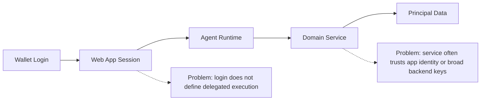
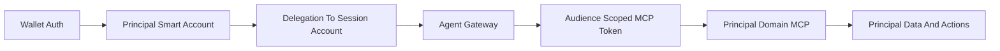
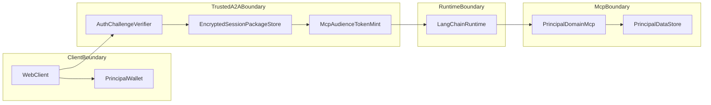
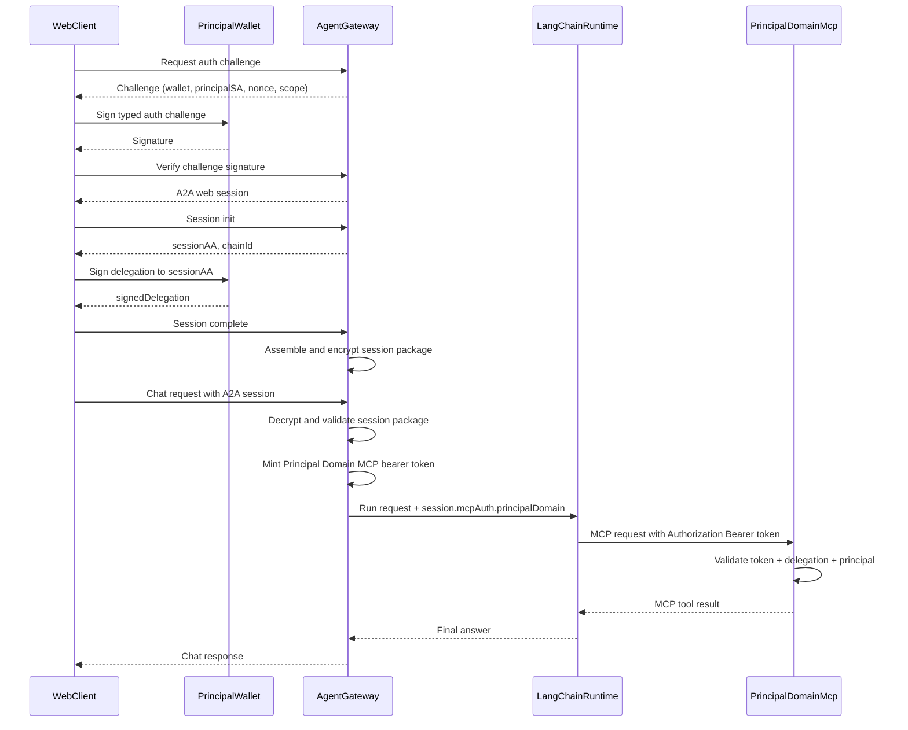
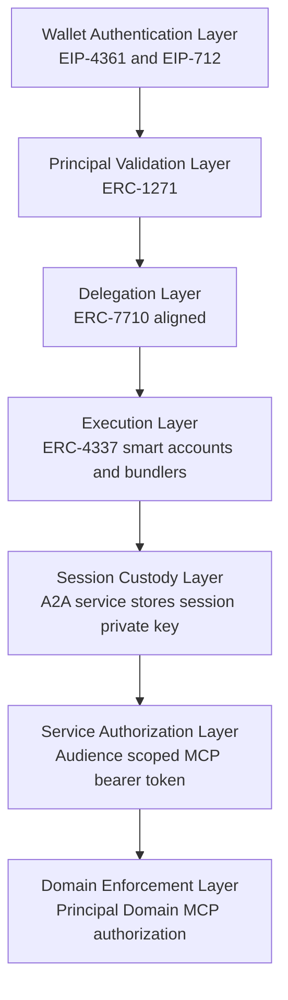

# SIWE For Agents + Principal Domain MCP Architecture

## Status

Draft protocol architecture document.

## Why This Exists

Wallet sign-in is good at answering one question: who controls this wallet right now.

It does not, by itself, answer the harder question this protocol is built for:

- how an agent can safely act for a person or organization
- across multiple domains such as Faith, Fitness, and Finance
- without exposing long-lived delegated keys to the browser
- without ever passing the session wallet private key out of the trusted A2A agent service
- without relying on broad backend API keys
- without trusting caller-supplied principal identifiers on downstream services

For most real agent systems, login is only the start. After login, the system still needs a secure way to:

- establish who the principal is
- delegate constrained authority to an agent runtime
- route that authority to the correct domain service
- let the domain service verify the chain before touching principal data or executing principal actions

Without this pattern, most systems collapse into one of two weak models:

- the browser or app gets too much long-lived authority
- the backend acts with broad service credentials and only loosely maps requests back to the user

This protocol exists to make delegated agent execution verifiable, scoped, and portable across domains, while keeping the session wallet private key securely stored inside the trusted A2A agent service at all times.

## Purpose

This document describes the end-to-end authentication, delegation, and authorization flow for an agent system that mediates access to principal-scoped domain services:

1. Web client
2. Per-user Agent Gateway
3. LangChain/LangGraph runtime
4. Principal Domain MCP

The goal is to provide a standards-style description of how SIWE-style wallet authentication, principal smart-account delegation, session packages, and MCP authorization work together to safely access principal-scoped data.

## Scope

This document covers:

- Web login and challenge signing
- A2A session establishment
- Delegation bootstrap
- Session package creation and storage
- Runtime MCP token minting
- LangChain MCP transport injection
- delegated Principal Domain MCP authorization

This document does not define:

- On-chain agent registration
- Multi-MCP federation beyond the Principal Domain MCP pattern
- Cross-domain revocation registries
- Non-wallet authentication methods

## High-Level Overview

The system separates authentication from delegation:

- Authentication proves that the web user controls the wallet authorized to act for the principal smart account.
- Delegation proves that the principal smart account delegated a constrained capability to a session smart account.
- Session packaging binds the delegated capability to a session key held only by the trusted A2A service.
- MCP authorization derives per-request bearer credentials from that stored session package.

At runtime, the web client never receives the session wallet private key. That key is generated for the session, securely stored inside the Agent Gateway, and never passed to the browser, the LangChain runtime, or the downstream MCP. The Agent Gateway instead derives a short-lived bearer token for a Principal Domain MCP and passes only that token through the runtime so the downstream MCP can validate the full chain before touching principal data.

## Approach And Value

The approach is to extend wallet sign-in into delegated agent execution:

- the wallet authenticates the user
- the principal smart account delegates to a session smart account
- the trusted Agent Gateway stores the session package
- the runtime mints audience-scoped MCP credentials from that package
- the downstream MCP verifies the delegated chain before allowing principal-scoped actions

Why this matters to a general web3 builder:

- wallet sign-in is not the end of the trust model; it becomes the start of a delegated execution chain
- one principal can authorize multiple domain agents without sharing root wallet authority
- the session wallet private key remains securely stored in the A2A agent service and is never passed out
- backend domain services do not need blanket API keys for principal-scoped operations
- each MCP audience can receive a separate, short-lived authorization artifact
- principal-linked writes can be strongly bound to the validated principal instead of caller-supplied identifiers
- the same pattern can work for a person, a family office, a church, a gym business, or another organization acting as a principal

Terminology used in this document:

- `Principal`
  - the person or organization on whose behalf the system is acting
- `Domain`
  - a bounded application area such as Faith, Fitness, or Finance
- `Principal Domain MCP`
  - an MCP service that exposes principal-scoped data and actions inside one domain

## Roles

- `WebClient`
  - User-facing Next.js application
  - Holds the authenticated browser session and access to the principal wallet signer
- `PrincipalWallet`
  - User-controlled EOA wallet used for SIWE-style challenge signing and smart-account delegation signing
- `PrincipalSmartAccount`
  - The long-lived smart account that represents the user/agent principal
- `AgentGateway`
  - Trusted service boundary
  - Generates session keys
  - Stores encrypted session packages
  - Mints MCP-scoped runtime auth artifacts
- `SessionSmartAccount`
  - Delegated session account derived by the A2A Agent
- `LangChainRuntime`
  - LangGraph/LangChain execution environment that invokes MCP tools
- `PrincipalDomainMcp`
  - Principal-scoped domain data and action service
  - Validates delegated runtime auth before allowing data access

## Security Goals

- The browser must not receive the session private key.
- A2A web auth must prove control of the wallet associated with the principal smart account.
- Delegation must be explicit from principal smart account to session smart account.
- MCP calls must be audience-scoped and short-lived.
- The Principal Domain MCP must reject calls that are expired, malformed, or not bound to the correct principal.
- Principal-linked writes must only affect the validated principal.

## Trust Boundaries

## Protocol Flow

### 1. Web Authentication Challenge

The web client requests an A2A authentication challenge.

The challenge binds:

- wallet address
- principal smart account
- agent handle
- origin
- challenge id
- nonce
- requested scope
- issue / expiry timestamps

The client signs typed data as the principal smart account path, not as an arbitrary raw EOA signature. The Agent Gateway verifies:

- challenge integrity
- wallet/principal binding
- ERC-1271 validity on the principal smart account

If successful, the Agent Gateway issues a short-lived A2A web session token.

### 2. Session Smart Account Initialization

Once a valid agent is available, the web client triggers session bootstrap.

The Agent Gateway service:

- creates a session key
- derives a session smart account
- optionally deploys the session smart account
- stores the private session material server-side only
- returns only:
  - `chainId`
  - `sessionAA`

This is the service-owned part of the split session flow.

### 3. Principal Delegation Signing

The web client asks the principal smart account to delegate to the session smart account.

The delegation is constrained for MCP usage and bound to:

- delegator: principal smart account
- delegatee: session smart account
- selector scope
- time-bounded session key validity

The client returns the signed delegation to the Agent Gateway, but never receives the session private key.

### 4. Session Package Assembly

The Agent Gateway assembles the final session package using:

- principal smart account
- session smart account
- session key
- signed delegation
- selector
- bundler / chain metadata

The final session package is encrypted and stored by account in the Agent Gateway service database.

### 5. Runtime MCP Auth Minting

When the user sends a chat message to the A2A endpoint:

1. A2A web session is verified.
2. The stored session package is decrypted.
3. The package is validated for freshness and required MCP permissions.
4. The Agent Gateway mints a short-lived MCP bearer artifact for a Principal Domain MCP.

That artifact includes:

- audience: `urn:mcp:server:principal-domain`
- principal identifiers
- session identifiers
- selector
- permissions hash
- signed delegation
- issued / expiry timestamps

It is signed in two ways:

- by the session key, proving possession of the delegated runtime key
- by the Agent Gateway issuer secret, proving the artifact was minted by the trusted gateway service

### 6. LangChain MCP Invocation

The Agent Gateway forwards the user request to LangChain/LangGraph and attaches runtime MCP auth metadata in the session payload.

The LangChain MCP loader converts that metadata into a per-request `Authorization: Bearer ...` header for the target Principal Domain MCP.

Static process-wide MCP headers are not used for this A2A-to-core path.

### 7. Principal Domain MCP Authorization

The Principal Domain MCP validates the delegated bearer token before serving the MCP request.

Validation checks include:

- issuer identity
- audience equals `urn:mcp:server:principal-domain`
- bearer token expiry window
- session key validity window
- issuer HMAC or equivalent service signature
- session key signature over the canonical claims payload
- signed delegation delegate equals session smart account
- signed delegation delegator equals principal smart account
- selector matches the expected delegated function scope

If validation succeeds, the MCP derives the request principal and uses it for principal-scoped authorization.

## End-To-End Sequence

## Data Model

### A2A Web Session

Represents successful challenge verification and is used to authorize A2A chat requests.

Suggested fields:

- `sessionId`
- `sessionToken`
- `accountAddress`
- `walletAddress`
- `principalSmartAccount`
- `agentHandle`
- `scope`
- `verifiedAtISO`
- `expiresAtISO`

### Session Package

Represents the server-stored delegated session state.

Core fields:

- `chainId`
- `aa` / `agentAccount`
- `sessionAA`
- `selector`
- `sessionKey`
  - `privateKey`
  - `address`
  - `validAfter`
  - `validUntil`
- `signedDelegation`
- `entryPoint`
- `bundlerUrl`

### Runtime MCP Delegation Token

Represents a short-lived bearer artifact minted by the Agent Gateway for a single MCP audience associated with principal-scoped domain data and action execution.

Core claims:

- `iss`
- `aud`
- `sub`
- `accountAddress`
- `agentHandle`
- `principalSmartAccount`
- `principalOwnerEoa`
- `sessionAA`
- `sessionKeyAddress`
- `sessionValidAfter`
- `sessionValidUntil`
- `selector`
- `permissionsHash`
- `signedDelegation`
- `issuedAtISO`
- `expiresAtISO`
- `nonce`

## Authorization Model

### Authentication

Authentication answers:

- Which wallet proved control?
- Which principal smart account accepted that wallet signature path?

### Delegation

Delegation answers:

- Which principal smart account delegated to which session smart account?
- Under what selector scope?
- For what validity interval?

### MCP Authorization

MCP authorization answers:

- Is this token intended for the target Principal Domain MCP?
- Is the session still valid?
- Is the token signed by the delegated session key?
- Did the trusted Agent Gateway mint this runtime artifact?
- Which principal should this MCP request run as?

## Principal-Scoped Data Enforcement

For a Principal Domain MCP, principal-linked tools must either:

- require the target `canonicalAddress` to equal the validated principal address, or
- derive the target principal from the validated auth context

This applies especially to:

- account writes
- customer creation
- instructor/profile writes
- external identity linking
- memory thread operations
- order creation
- reservation records

## Failure Semantics

The protocol is fail-closed.

Requests must be rejected if:

- auth challenge verification fails
- delegation bootstrap is incomplete
- session package is missing
- session package is expired
- required MCP permission is absent
- bearer audience is wrong
- session-key signature is invalid
- issuer signature is invalid
- delegation binding is inconsistent
- principal does not match the requested data target

No static API-key fallback should be used for A2A-originated principal-scoped requests to a Principal Domain MCP.

## Implementation Mapping

- Web challenge and session bootstrap
- A2A runtime and session package storage
- LangChain MCP injection
- MCP authorization and principal enforcement

## Standardization Notes

To evolve this into a protocol standards document, the next step is to formalize:

- canonical bearer token encoding
- canonical claims serialization
- issuer signature algorithm requirements
- delegation selector semantics
- replay protection expectations
- revocation and rotation rules
- MCP audience naming conventions for Principal Domain services
- principal-scoped tool behavior requirements

## Summary

This architecture defines a clean chain of trust:

1. Wallet challenge proves user control.
2. Principal smart account delegates to a session smart account.
3. A trusted Agent Gateway stores the session package.
4. Runtime MCP bearer auth is minted from that package.
5. The target Principal Domain MCP validates the delegated chain before touching principal data.

This gives a SIWE-for-Agents style flow that extends beyond login into delegated, audience-scoped MCP execution.

## How This Differs From SIWE

SIWE primarily answers a login question: which wallet controls this session right now.

This architecture goes further:

- SIWE authenticates the wallet holder; this architecture authenticates and then delegates execution
- SIWE usually terminates in a web or API session; this architecture continues into agent-runtime and MCP authorization
- SIWE does not by itself define downstream capability delegation; this architecture binds a principal smart account to a session smart account
- SIWE does not define audience-scoped MCP bearer artifacts; this architecture mints short-lived MCP-specific auth from the stored session package
- SIWE is often sufficient for user login; this architecture is designed for delegated machine execution on behalf of the user

In short, SIWE is the identity entry point, while this model defines the full post-login execution chain.

## How This Differs From OWS

OWS-style systems generally emphasize a web-session or service-session trust model in which the backend issues or manages bearer-style authorization for downstream services.

This architecture differs in several important ways:

- the root of trust is wallet authentication plus smart-account delegation, not only a service session
- delegated authority is explicitly bound to a session smart account and session key, rather than only to an opaque backend session
- the browser never receives the delegated runtime key material
- downstream MCP services validate delegation-linked claims, not just bearer possession
- authorization is audience-scoped and principal-scoped for MCP execution, rather than being a broad session token pattern

In short, OWS-style models are typically service-session centric, while this model is delegation-chain centric and wallet-rooted.

## Technical Architecture And Standards

This protocol is not a single existing standard. It is a composed architecture that combines wallet authentication, smart-account delegation, session-key custody, account-abstraction execution, and MCP audience authorization into one end-to-end trust chain.

The main technical pieces are:

- wallet authentication for the human-controlled or organization-controlled signer
- principal smart-account delegation to a constrained session account
- secure server-side custody of the session wallet private key inside the A2A agent service
- account-abstraction compatible session execution
- audience-scoped bearer authorization for downstream MCP services
- principal-scoped authorization enforcement inside each domain MCP

### Standards And Primitives Used

#### EIP-4361 / SIWE

SIWE is the conceptual entry point for wallet-rooted authentication in this architecture.

It answers the initial question:

- which wallet is logging in
- which session is being established

By itself, SIWE is not sufficient for delegated agent execution, but it is a useful starting point for the wallet-auth layer.

#### EIP-712 Typed Structured Data

EIP-712 is the preferred signing format for:

- A2A authentication challenges
- delegation payloads
- typed claims that need wallet-verifiable integrity

Its role here is to make signatures explicit, structured, replay-resistant, and machine-verifiable.

#### ERC-1271 Contract Signature Validation

ERC-1271 is required when the acting principal is represented by a smart account rather than only by an EOA.

Its role here is to let the Agent Gateway and downstream services verify that:

- a principal smart account accepted the challenge signature path
- a smart-account-based principal is the real authority behind the authenticated session

#### ERC-4337 Account Abstraction

ERC-4337 provides the account-abstraction execution model used by smart accounts in this design.

Its role here is to support:

- principal smart accounts
- session smart accounts
- programmable validation logic
- bundler-based execution
- compatibility with modern smart-wallet flows

This architecture is designed to fit naturally into an ERC-4337 environment even though the downstream MCP authorization artifact is offchain.

#### ERC-7710 Smart Contract Delegation

ERC-7710 is a strong conceptual fit for the delegation layer of this protocol and should be treated as the closest standards-track reference for smart-account delegation in this document.

Its role here is to describe the delegation relationship between:

- the principal smart account as delegator
- the session smart account as delegate
- a constrained capability scope
- bounded validity windows

Important note: ERC-7710 is currently draft, so this document should treat it as an emerging standard that informs the delegation model rather than as a finalized dependency.

#### Session Keys

Session keys are the runtime authority used after delegation is granted.

In this architecture:

- the session wallet private key is generated for the delegated session
- it is securely stored only inside the A2A agent service
- it is never passed to the browser
- it is never passed to LangChain or LangGraph
- it is never passed to the downstream MCP

This is one of the core security properties of the architecture.

#### MCP

Model Context Protocol is the service invocation boundary used for domain tools and domain data access.

Its role here is to provide:

- a standard tool invocation surface
- a clean downstream authorization boundary
- a place to enforce audience-scoped and principal-scoped access rules

This document extends MCP with a delegated bearer-auth pattern so the target Principal Domain MCP can validate the upstream wallet-to-delegation-to-session chain before serving a request.

### Architecture Layering

The full stack can be viewed in layers:

### Technical Responsibilities By Component

#### Web Client

- obtains the auth challenge
- asks the wallet or smart account path to sign
- requests delegation to the session account
- never receives the session wallet private key

#### A2A Agent Service

- verifies wallet and smart-account authentication
- generates the session wallet and session account
- securely stores the session wallet private key
- assembles and encrypts the session package
- mints short-lived MCP audience tokens from the stored session package

#### LangChain Or LangGraph Runtime

- receives runtime-scoped MCP auth metadata from the A2A service
- forwards the delegated bearer artifact to the correct MCP target
- does not hold root authority for the principal

#### Principal Domain MCP

- validates audience, expiry, issuer signature, session-key signature, and delegation binding
- derives the validated principal from auth context
- rejects any attempt to act outside the validated principal scope

### What Is Standardized Versus Protocol-Specific

The architecture intentionally composes both standardized and protocol-specific layers.

Standardized or standards-aligned layers:

- EIP-4361 for wallet sign-in concepts
- EIP-712 for typed signing
- ERC-1271 for smart-account signature validation
- ERC-4337 for account-abstraction execution
- ERC-7710 as an emerging reference for delegation semantics
- MCP for downstream tool invocation boundaries

Protocol-specific layers in this document:

- the session package format and storage model
- the audience-scoped MCP bearer token format
- the issuer-signature and claims-canonicalization rules
- the principal-domain audience naming conventions
- the exact fail-closed authorization behavior inside Principal Domain MCP services

This split is important: the protocol builds on familiar web3 standards, but the full delegated agent-to-MCP trust chain still requires application-layer standardization on top of them.
