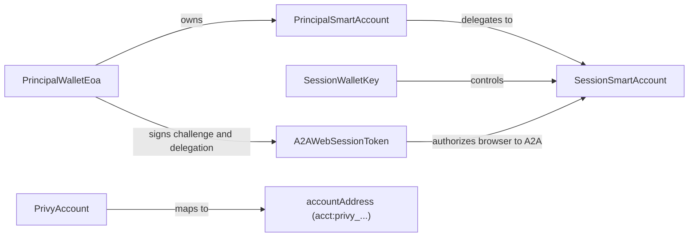
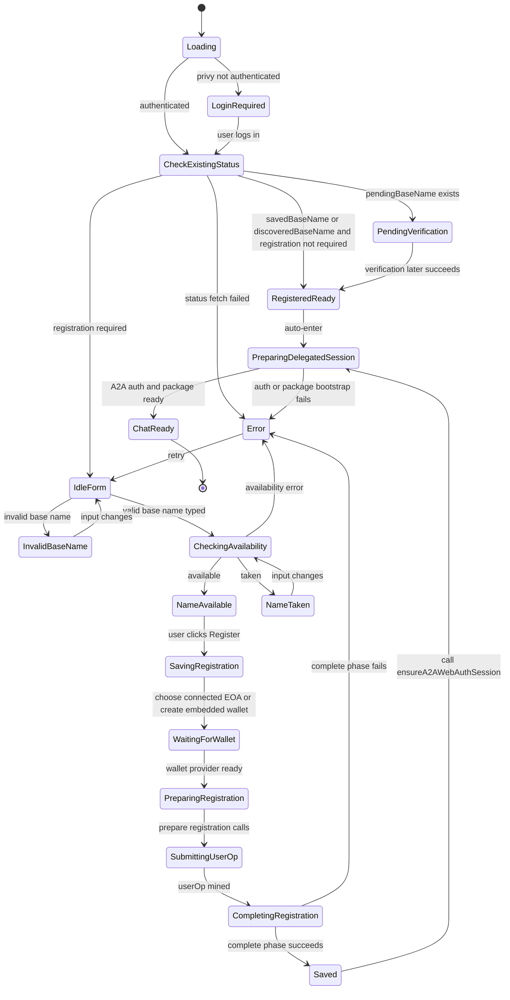
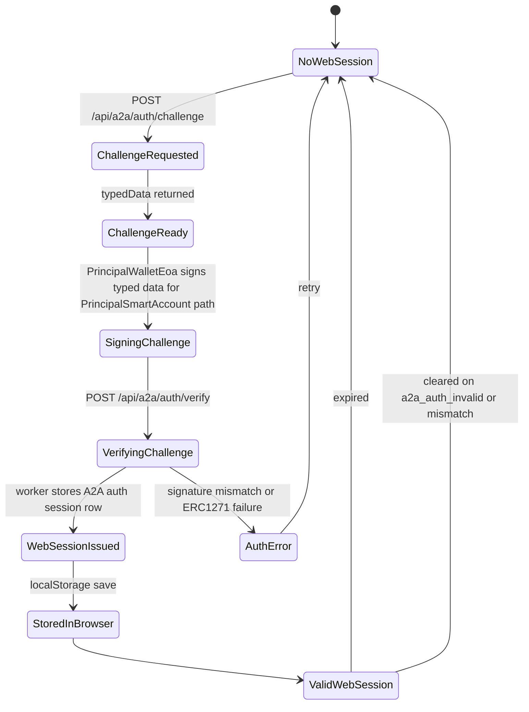
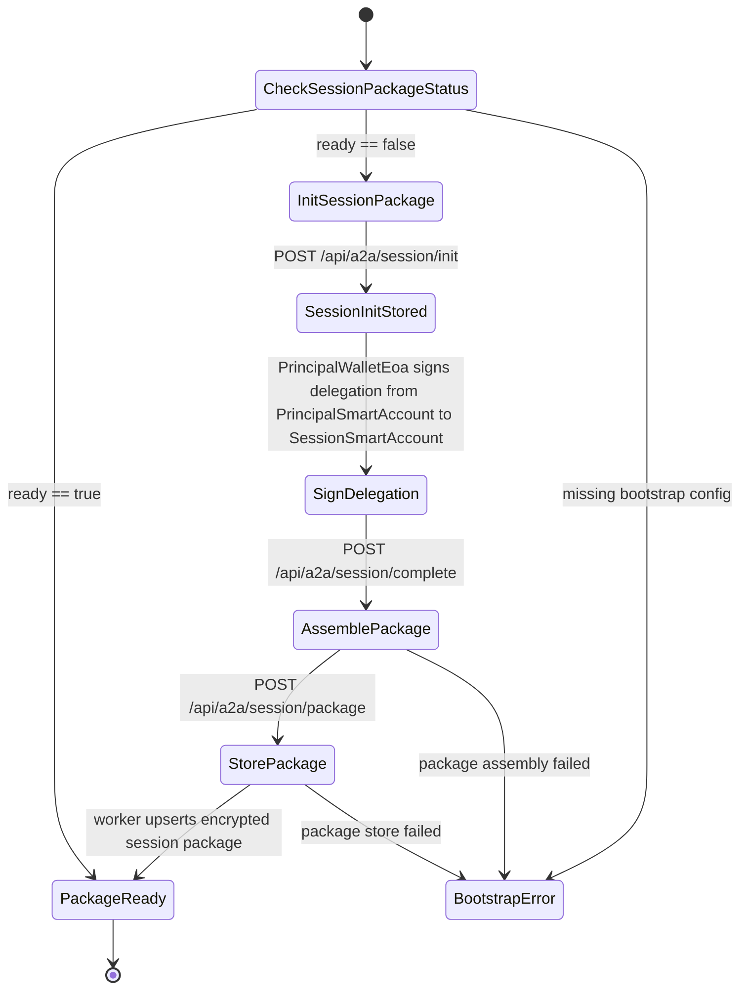
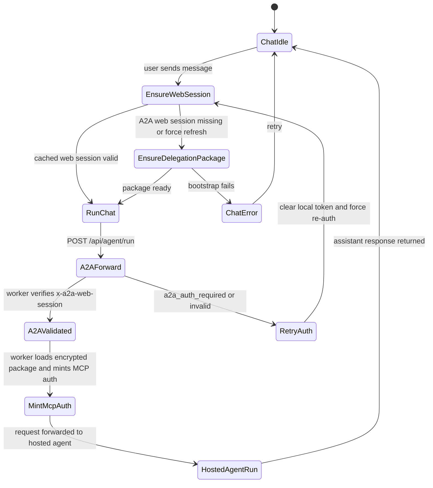
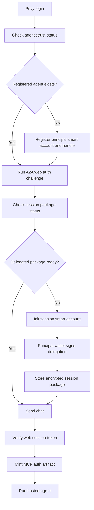

# Web App Agent Registration And Session States

## Purpose

This document describes the state transitions implemented in the web app for:

- agent registration
- A2A web authentication
- delegated session-package bootstrap
- chat execution through the hosted agent

It is intentionally narrower than `documents/siwe-for-agents-mcp-architecture.md`.

This document focuses on what the web app actually does today.

## Main Actors

- `PrivyAccount`
  - Web identity used for application login
  - Produces the canonical `accountAddress`

- `PrincipalWalletEoa`
  - The connected Ethereum wallet EOA
  - Preferred signing source for registration and A2A auth
  - External wallet first, embedded Privy wallet second

- `PrincipalSmartAccount`
  - The registered agent smart account
  - The long-lived authority root for the user agent

- `SessionWalletKey`
  - Ephemeral session key generated during session init
  - Stored server-side in the A2A worker package flow

- `SessionSmartAccount`
  - The delegate smart account derived from the session key
  - Receives constrained delegation from the principal smart account

- `A2AWebSessionToken`
  - Opaque web-session token returned after challenge verification
  - Used by the browser on chat requests to the A2A endpoint

## Source Files

- `apps/web/app/agent/register/register-client.tsx`
- `apps/web/components/agentictrust/a2a-web-auth.ts`
- `apps/web/app/chat/page.tsx`
- `apps/web/app/api/agentictrust/status/route.ts`
- `apps/web/app/api/agentictrust/register/route.ts`
- `apps/web/app/api/a2a/auth/challenge/route.ts`
- `apps/web/app/api/a2a/auth/verify/route.ts`
- `apps/web/app/api/a2a/session/status/route.ts`
- `apps/web/app/api/a2a/session/init/route.ts`
- `apps/web/app/api/a2a/session/complete/route.ts`
- `apps/web/app/api/a2a/session/package/route.ts`
- `apps/web/app/api/agent/run/route.ts`
- `apps/gym-a2a-agent/src/index.ts`

## Identity Relationships

## Registration Flow

This is the state machine implemented by `register-client.tsx`.

## Registration Details

At registration time the web app is doing two different things:

1. It discovers or allocates the long-lived `PrincipalSmartAccount`.
2. It stores enough metadata so chat can later resolve:
   - `agentHandle`
   - `a2aHost`
   - `principalSmartAccount`
   - `principalOwnerEoa`

The important distinction is:

- registration creates or verifies the principal agent identity
- session bootstrap creates the delegated runtime identity

## A2A Web Authentication Flow

This is the challenge and opaque browser-session flow used before chat.

## Delegated Session Package Bootstrap

This is the second half of `ensureA2AWebAuthSession`.

## Delegation Roles

In the current web app flow:

- `PrincipalWalletEoa`
  - owns the principal smart account
  - signs the challenge path
  - signs the delegation payload

- `PrincipalSmartAccount`
  - is the long-lived registered agent identity
  - is the delegator in the session package flow

- `SessionWalletKey`
  - is generated during session init
  - is not returned to the browser as an application-level credential

- `SessionSmartAccount`
  - is the delegate runtime smart account
  - is what the principal smart account delegates to

## Chat Execution Flow

Once registration and package bootstrap are done, the chat page uses this flow.

## End-To-End Web App View

## What The User Actually Experiences

The UI does not expose all of these internal states as separate screens.

What the user mostly sees is:

- registration form states
- waiting messages
- wallet prompts for signing
- the chat input becoming usable

The deeper state machine is distributed across:

- browser local storage
- Next.js API routes
- A2A worker challenge rows
- A2A worker auth-session rows
- A2A worker session-init rows
- A2A worker encrypted session-package rows

## Practical Summary

The web app has two separate identity transitions:

1. `PrincipalWalletEoa -> PrincipalSmartAccount`
   - registration and long-lived agent identity

2. `PrincipalSmartAccount -> SessionSmartAccount`
   - delegated runtime session used for downstream authorization

The opaque `A2AWebSessionToken` sits beside that delegated chain.

It does not replace delegation.

It proves that the browser completed the A2A wallet-auth challenge and is allowed to ask the A2A worker to mint runtime auth from the stored delegated session package.
