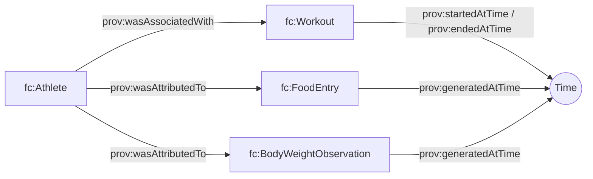

# Core T-Box (`tbox/core.ttl`)

## Purpose

Defines the shared “spine” used by every FitnessCore dataset:

- **PROV-O** for attribution, time, provenance
- **P-Plan / EP-PLAN** for plan ↔ execution correspondence (optional for fitness data, but kept for alignment)
- **DUL / SOSA** hooks for richer modeling (optional)

## Key modeling conventions

- **Everything is provenance-aware**: activity and observation timestamps are expressed with `prov:startedAtTime`, `prov:endedAtTime`, or `prov:generatedAtTime`.
- **Actors**: workouts/food/weights are attributed to an `fc:Athlete` via `prov:wasAssociatedWith` / `prov:wasAttributedTo`.

## Diagram (high-level)

## Query implications

Most SPARQL queries should:

- scope to the user’s named graph: `GRAPH <...> { ... }`
- filter by time windows using `prov:*AtTime` properties

