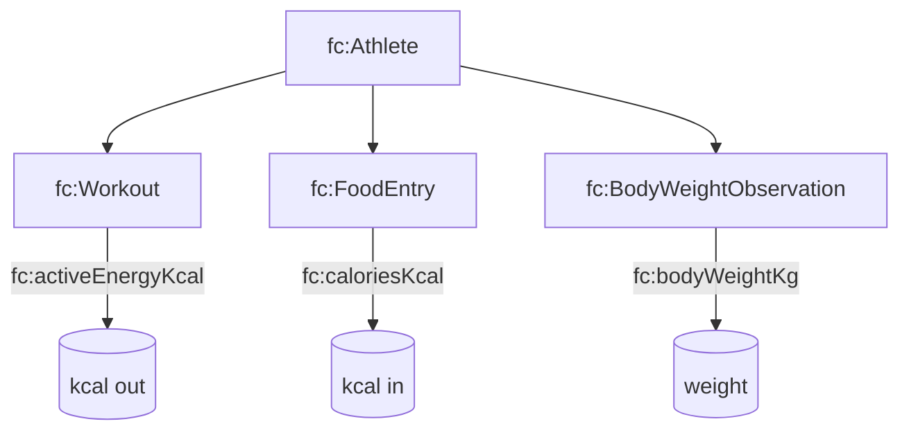

# Fitness T-Box (`tbox/fitness.ttl`)

## Purpose

Defines the **primary application concepts** used by sync + querying:

- `fc:Workout` (Strava)
- `fc:FoodEntry` (weight management meals)
- `fc:BodyWeightObservation` (weight log)
- `fc:Athlete` (the person the data is about)

## Key classes + properties

### Workouts

- **Class**: `fc:Workout`
- **Time**: `prov:startedAtTime`, `prov:endedAtTime`
- **Attribution**: `prov:wasAssociatedWith` (to `fc:Athlete`)
- **Metrics**:
  - `fc:activityType` (typically a SKOS concept IRI from the C-Box)
  - `fc:durationSeconds` (integer)
  - `fc:distanceMeters` (decimal)
  - `fc:activeEnergyKcal` (decimal, optional)

### Food

- **Class**: `fc:FoodEntry`
- **Time**: `prov:generatedAtTime`
- **Attribution**: `prov:wasAttributedTo`
- **Metrics**:
  - `fc:caloriesKcal` (decimal)
  - `fc:proteinGrams`, `fc:carbsGrams`, `fc:fatGrams` (decimal, optional)

### Weight

- **Class**: `fc:BodyWeightObservation` (also aligns with `sosa:Observation`)
- **Time**: `prov:generatedAtTime`
- **Metric**: `fc:bodyWeightKg` (decimal)

## Diagram (data triangle)

## Typical SPARQL patterns

- **Workouts on a day**: `?w a fc:Workout ; prov:startedAtTime ?t . FILTER(...)`
- **Daily exercise kcal**: `SELECT (SUM(?k) AS ?exerciseKcal) WHERE { ... OPTIONAL { ?w fc:activeEnergyKcal ?k } ... }`
- **Daily intake kcal**: `SELECT (SUM(?k) AS ?kcalTotal) WHERE { ... ?e a fc:FoodEntry ; fc:caloriesKcal ?k ... }`

