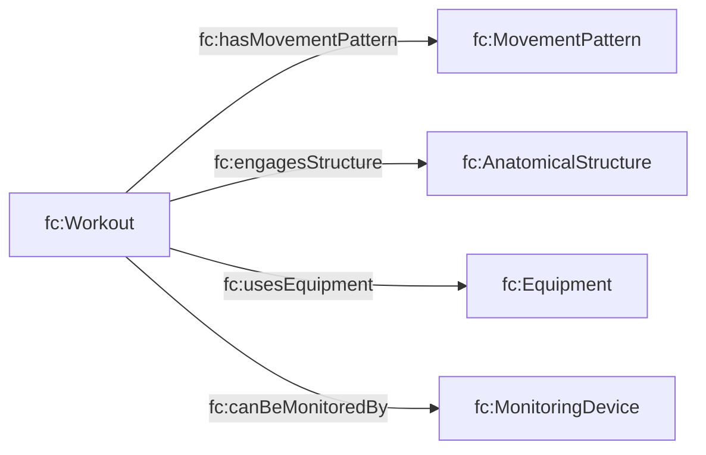

# Movement T-Box (`tbox/movement.ttl`)

## Purpose

Adds OPE-inspired “semantic exercise” descriptors to workouts:

- movement patterns (e.g., squat / hinge / press)
- anatomy (structures engaged)
- equipment
- monitoring devices

These are **optional enrichments**: they improve query and coaching quality, but aren’t required for basic calorie/workout reporting.

## Diagram

## Query examples (conceptual)

- “Workouts engaging hamstrings”: find workouts with `fc:engagesStructure` = hamstring structure.
- “Equipment-based planning”: filter workouts with `fc:usesEquipment` = barbell.

