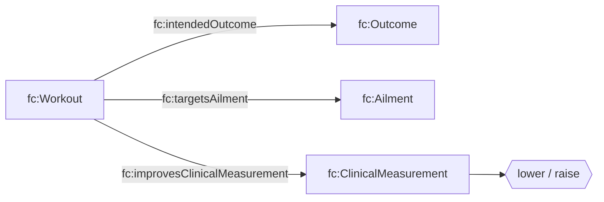

# Health T-Box (`tbox/health.ttl`)

## Purpose

Adds OPE-inspired health/outcome modeling:

- `fc:Outcome` (intended or observed)
- `fc:Ailment` (conditions a program targets)
- `fc:ClinicalMeasurement` and “improves/raises/lowers” links

Like movement, this is **optional enrichment** that helps with “why” and “what should I do” queries.

## Diagram

## Query implications

This module enables queries like:

- “What workouts target knee pain?” (via `fc:targetsAilment`)
- “What training improves blood pressure?” (via `fc:lowersClinicalMeasurement`)

