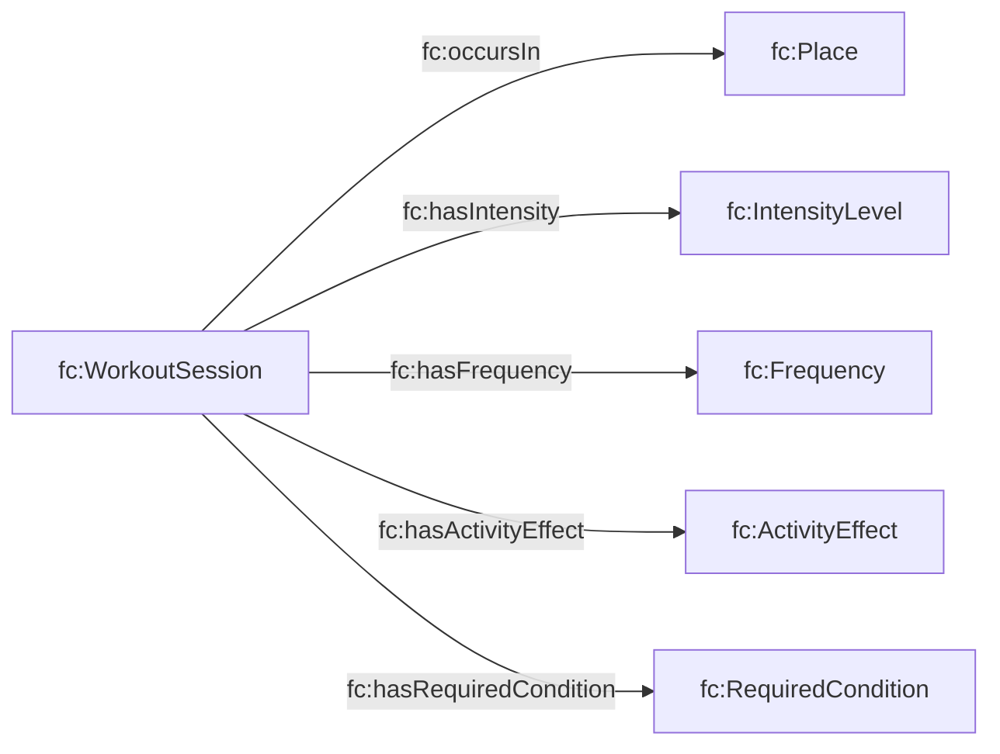

# Context T-Box (`tbox/context.ttl`)

## Purpose

Adds PACO-style “real-world activity context”:

- sessions / places
- intensity levels
- frequency + totals
- required conditions + effects

This supports queries like “how hard was it?”, “how often?”, and “where?”.

## Diagram

## Query implications

- “Show vigorous sessions last week”: filter sessions with `fc:hasIntensity` concept.
- “Summarize minutes/week”: use `fc:hasTotalAmountMinutes` (if populated).

