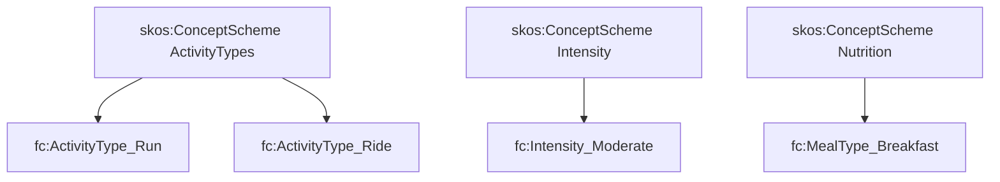

# C-Box (concept schemes)

FitnessCore uses SKOS concept schemes for controlled vocabularies.

## Activity types (`cbox/activity-types.ttl`)

- concepts like `fc:ActivityType_Run`, `fc:ActivityType_Ride`, …
- used by `fc:activityType` on `fc:Workout`

## Intensity (`cbox/intensity.ttl`)

- concepts like `fc:Intensity_Low`, `fc:Intensity_Moderate`, `fc:Intensity_Vigorous`
- intended for `fc:hasIntensity` on `fc:WorkoutSession`

## Nutrition (`cbox/nutrition.ttl`)

- meal-type concepts (breakfast/lunch/dinner/snack) — currently not wired as a first-class property in sync, but available for future enrichment

## Diagram

