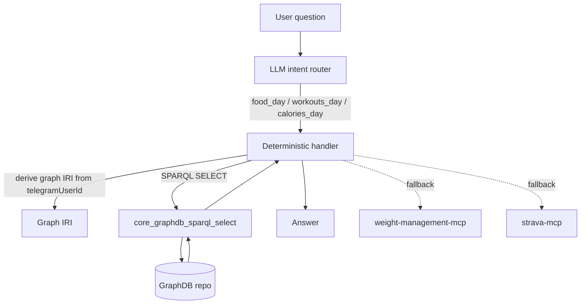

# LangSmith agent + FitnessCore GraphDB integration

## What “default to GraphDB” means

For **workout/food/calorie questions**, the agent should:

- **Prefer GraphDB (FitnessCore named graph) via SPARQL**
- **Fallback** to `weight-management-mcp` / `strava-mcp` if:
  - the user has no Telegram ID in session
  - the graph is empty / stale
  - a query needs data that hasn’t been mapped into RDF yet

## Runtime flow (today/day questions)



## Named graph convention

Each Telegram user’s dataset is stored in a dedicated named graph:

- **base**: `FITNESSCORE_GRAPH_CONTEXT_BASE` (default `https://id.fitnesscore.ai/graph/d1`)
- **graph IRI**: `${base}/tg%3A<telegramUserId>`

This matches the `gym-cron-sync` uploader.

## How the LLM constructs correct SPARQL (with ontology help)

The agent uses **ontology documentation** (T-Box/C-Box) as retrieval context so the model can:

- pick the right **classes** (`fc:Workout`, `fc:FoodEntry`, `fc:BodyWeightObservation`)
- pick the right **properties**:
  - time: `prov:startedAtTime`, `prov:generatedAtTime`
  - metrics: `fc:activeEnergyKcal`, `fc:caloriesKcal`, `fc:bodyWeightKg`
- pick the right **graph scoping** pattern: `GRAPH <...> { ... }`
- use standard **aggregation** patterns: `SUM`, `COUNT`, `ORDER BY`

### Mental model mapping (NL → SPARQL)

```mermaid
flowchart LR
  NL[\"How many calories did I burn yesterday?\"] --> C1[Identify intent: exercise_burn_day]
  C1 --> C2[Pick class: fc:Workout]
  C2 --> C3[Pick metric: fc:activeEnergyKcal]
  C3 --> C4[Pick time filter: prov:startedAtTime within day window]
  C4 --> C5[Aggregate: SUM(?k)]
  C5 --> Q[Emit SPARQL query]
```

## Using GraphDB for RAG/system prompts vs direct querying

There are two complementary uses:

### 1) RAG for better prompts (ontology + query templates)

- store ontology docs in the KB (markdown)
- use `knowledge_search` to fetch the right schema snippets
- include them in the system/developer context so the LLM produces valid SPARQL

```mermaid
flowchart TD
  Q[User asks question] --> KS[knowledge_search]
  KS --> KB[(KB chunks: ontology docs)]
  KB --> KS --> SP[\"Schema context\" injected]
  SP --> LLM[LLM writes SPARQL]
  LLM --> C[core_graphdb_sparql_select]
```

### 2) Direct SPARQL querying for factual answers

- workouts list
- daily intake / burn sums
- weight trends

## Configuration

### Agent

- `FITNESSCORE_USE_GRAPHDB=1` (default)
- `FITNESSCORE_GRAPH_CONTEXT_BASE=https://id.fitnesscore.ai/graph/d1` (default)

### `gym-core-mcp` (GraphDB proxy tool)

Set these on the `gym-core-mcp` worker:

- `GRAPHDB_BASE_URL`
- `GRAPHDB_REPOSITORY`
- `GRAPHDB_USERNAME`
- `GRAPHDB_PASSWORD`
- optional: `GRAPHDB_CF_ACCESS_CLIENT_ID`, `GRAPHDB_CF_ACCESS_CLIENT_SECRET`

## Security boundary

The agent calls **only** `gym-core-mcp` for SPARQL; GraphDB credentials stay inside the worker env/secrets.

